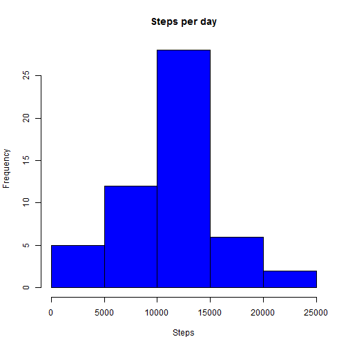
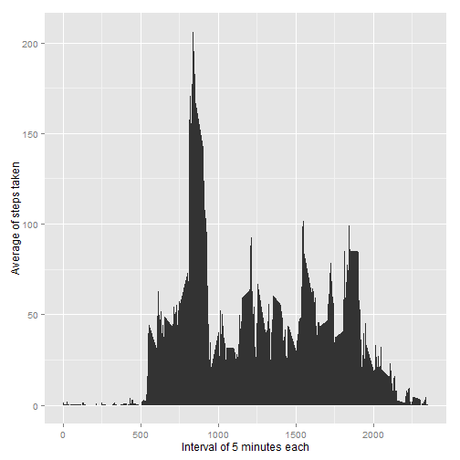
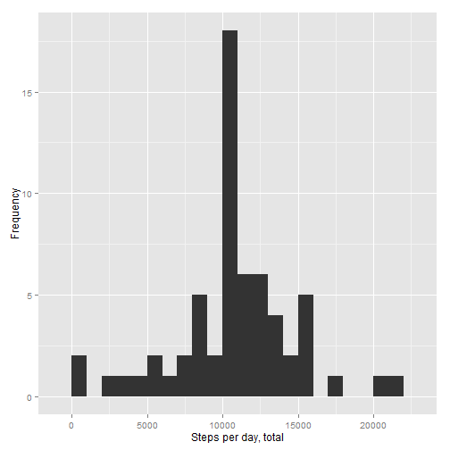
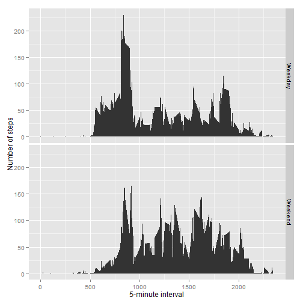

1. Setup of libraries  


```r
library(ggplot2)
library(RCurl)
```

```
## Loading required package: bitops
```

2. Two functions were used for the calculations, functions usually are integrated in separated files.
Setup of Functions:  


```r
## Function to replace each NA value with the mean value of its 5-minute interval
fillFunc <- function(steps, interval) {
        filled <- NA
        if (!is.na(steps))
                filled <- c(steps)
        else
                filled <- (averagedData[averagedData$interval==interval, "steps"])
        return(filled)}

## Function to define day of the week
dayDef <- function(date) {
        day <- weekdays(date)
        if (day %in% c("Monday", "Tuesday", "Wednesday", "Thursday", "Friday"))
                return("Weekday")
        else if (day %in% c("Saturday", "Sunday"))
                return("Weekend")
        else
                stop("Invalid entry")
}
```

The data is downloaded, unizipped and inserted into a data.frame:


```r
download.file(url = "http://d396qusza40orc.cloudfront.net/repdata%2Fdata%2Factivity.zip", destfile = "data.zip",mode = "wb")
unzip("data.zip", overwrite = T)
data<-read.csv("activity.csv", header=T, colClasses="character")
```

The clases of the columns were modified:


```r
## Preparation of data.frame
data$date<-as.Date(data$date, format="%Y-%m-%d")
data$steps<-as.numeric(data$steps)
data$interval<-as.numeric(data$interval)
```

## Question 1: What is mean total number of steps taken per day?

Removing NA values:


```r
## NA omision
data2<-data[!is.na(data$steps),]
```

Histogram using lapply to show the answer to the question:


```r
## Make a histogram of the total number of steps taken each day
x<-lapply(split(data2$steps,data2$date), sum)
x<-stack(x)
x$ind<-as.Date(x$ind)
hist(x$values,
     col = "blue", 
     main="Steps per day", 
     xlab="Steps", 
     ylab="Frequency")
```

 

Result of the mean and the median:


```r
## Calculation of mean and median 
stepsPerDay <- aggregate(steps ~ date, data2, sum)$steps
mean(stepsPerDay)
```

```
## [1] 10766.19
```

```r
median(stepsPerDay)
```

```
## [1] 10765
```

## Question 2: What is the average daily activity pattern?

Making of a time series plot of the 5-minute interval (x-axis) and the average number of steps taken, averaged across all days (y-axis)


```r
## Average daily activity 
averagedData <- aggregate(x=list(steps=data$steps), by=list(interval=data$interval),FUN=mean, na.rm=TRUE)
ggplot(data=averagedData, aes(x=interval, y=steps)) + 
        geom_area() +xlab("Interval of 5 minutes each") +
        ylab("Average of steps taken") 
```

 

This is the interval that contains the maximun number of steps:


```r
## Interval with max value
averagedData[which.max(averagedData$steps),]
```

```
##     interval    steps
## 104      835 206.1698
```

## Imputing of averaged valued into missing values

How many NA values are there?


```r
## NA values and result
valueNA <- is.na(data$steps)
table(valueNA)
```

```
## valueNA
## FALSE  TRUE 
## 15264  2304
```

Replacement of missing values:


```r
# NA replacement
data3 <- data
data3$steps <- mapply(fillFunc, data3$steps, data3$interval)
```

Impact of the substitution of missing values can be seen in this plot:


```r
# Plot with substituted elements
stepsTotal <- tapply(data3$steps, data3$date, FUN=sum)
qplot(stepsTotal, binwidth=1000, 
      xlab="Steps per day, total", 
      ylab="Frequency")
```

 

```r
mean(stepsTotal)
```

```
## [1] 10766.19
```

```r
median(stepsTotal)
```

```
## [1] 10766.19
```

## Question 3: Are there differences in activity patterns between weekdays and weekends?

Aplication of day-defining function


```r
## Aplication of dayDef FUN
data3$date <- as.Date(data3$date)
data3$day <- sapply(data3$date, FUN=dayDef)
```

Throught this plot the answer to the question can be seen:


```r
## Answer to: Are there differences in activity patterns between weekdays and weekends?
averagedData <- aggregate(steps ~ interval + day, data=data3, mean)
ggplot(averagedData, aes(interval, steps)) + geom_area() + facet_grid(day ~ .) + 
        xlab("5-minute interval") + 
        ylab("Number of steps")
```

 
